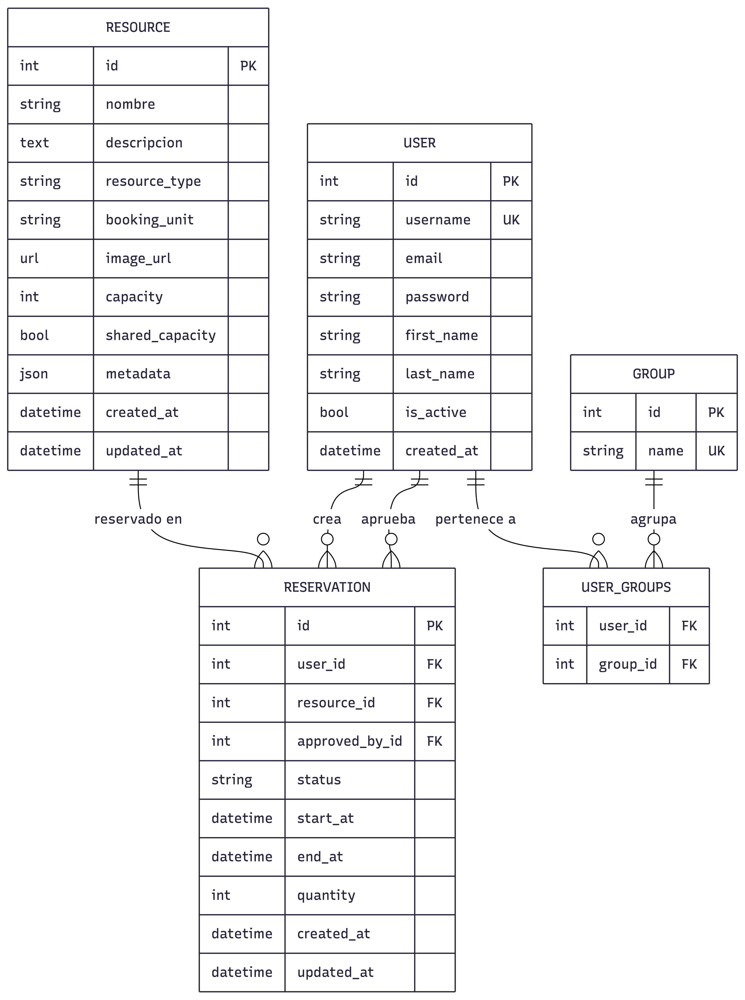
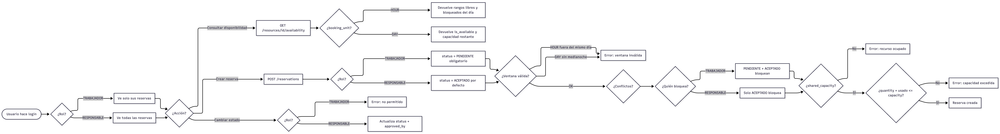
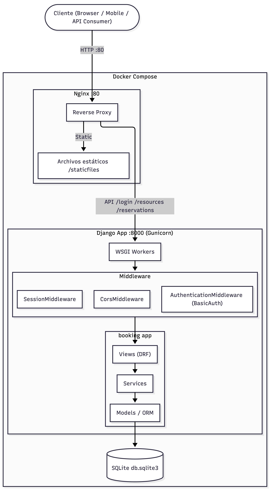

# Booking System

## Ejecutar

```bash
docker compose up -d --build
```

La API estará disponible en **http://localhost:80**.

## Probar la API

> **Postman:** Importa `booking_api.postman_collection.json` — todos los endpoints están preconfigurados con ejemplos.

| Método | Ruta | Descripción |
|--------|------|-------------|
| GET | `/resources` | Listar recursos |
| GET | `/resources/{id}/availability?date=YYYY-MM-DD` | Consultar disponibilidad |
| GET/POST | `/reservations` | Listar / crear reservas |
| GET/PUT/PATCH/DELETE | `/reservations/{id}` | Gestionar una reserva |

## Diseño y decisiones

**Autenticación**
- Usa HTTP Basic Auth: cada request debe incluir el header `Authorization: Basic <base64(username:password)>`
- El rol del usuario (trabajador o responsable) viene del grupo de Django al que pertenece, sin campo extra en el modelo
- Usuarios de prueba precargados:

| Rol | Usuario | Contraseña |
|-----|---------|------------|
| Trabajador | `ivan.romero` | `worker123` |
| Responsable | `admin` | `manager123` |

**Estructura del proyecto**
- La lógica de negocio vive en `services/` — las vistas solo reciben el request y devuelven la respuesta
- Los serializers validan los datos de entrada (ventana horaria, conflictos, permisos) antes de pasar al servicio

**Modelos**
- Los recursos pueden ser exclusivos (un vehículo, una sala entera) o compartidos (sala con aforo), todo con el mismo modelo usando `shared_capacity` y `capacity`
- Las reglas de cada tipo de recurso (vehículos solo por día, salas solo por hora) se aplican en el modelo para que no puedan saltarse desde ningún punto de entrada

**Reservas**
- Un trabajador solo puede crear reservas en estado `PENDIENTE`; un responsable las crea directamente en `ACEPTADO`
- Al comprobar conflictos, los trabajadores también bloquean contra reservas pendientes; los responsables solo contra las aceptadas — el mismo algoritmo cambia de comportamiento según el rol
- En recursos compartidos, la disponibilidad se calcula por tramos de tiempo para detectar solapamientos parciales

**Infraestructura**
- Nginx recibe las peticiones, sirve los estáticos directamente y redirige la API a Gunicorn
- SQLite cubre el scope del proyecto; cambiar a PostgreSQL no requeriría tocar la lógica

## Diagramas

### Modelo de datos


### Flujo de reservas


### Infraestructura


## Desarrollo local

Requiere [uv](https://github.com/astral-sh/uv) y Python 3.12.

```bash
uv sync && uv run manage.py migrate && uv run manage.py runserver
```
